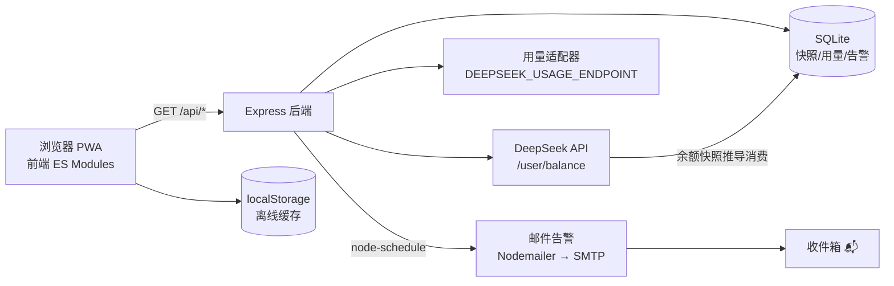

# DeepSeek Monitor

> 💰 **你的大模型 API 余额管家** —— 实时监控 DeepSeek 账户余额、用量趋势，支持多密钥管理与多通道告警。

[](https://nodejs.org)
[](https://www.docker.com)
[](https://developer.mozilla.org/docs/Web/Progressive_web_apps)
[](LICENSE)

---

## ✨ 功能特性

- 💰 **余额监控** —— 定时轮询 DeepSeek `/user/balance`，余额变化实时可见
- 📊 **用量趋势** —— 消费金额折线图，支持近 7 / 30 / 90 天切换与模型筛选
- 🔑 **多密钥管理** —— 为多个 API Key 设置别名、独立阈值，支持暂停 / 默认 / 删除
- 🔔 **多通道告警** —— 顶部横幅 + 系统通知 + 移动端振动 + 强制弹窗
- 📧 **邮件告警** —— 余额不足时每小时自动发送提醒邮件（Nodemailer）
- 📱 **PWA 支持** —— 可安装到桌面 / 主屏，离线展示缓存数据
- 🐳 **云端就绪** —— Docker 多阶段构建，一键部署到 Railway

---

## 🏗️ 技术架构



**数据流说明**

1. 后端 `scheduler.js` 每 `POLL_INTERVAL_MIN` 分钟遍历所有启用密钥，调用 DeepSeek 余额接口。
2. 余额写入 SQLite（`global_snapshots` / `snapshots`），并据此**推导每日消费**。
3. 前端每 `REFRESH_INTERVAL` 毫秒轮询后端 API 渲染图表；成功数据写入 `localStorage`。
4. 网络离线或接口限流时，前端自动回退展示缓存数据并提示"当前为缓存数据"。
5. 任一密钥余额跌破独立阈值 → 横幅 + 系统通知 + 振动 + 弹窗 + （可选）邮件。

---

## 🚀 快速开始

### 1. 克隆项目

```bash
git clone https://github.com/yourname/deepseek-monitor.git
cd deepseek-monitor
```

### 2. 配置环境变量

```bash
# Linux / macOS
export DEEPSEEK_API_KEY=sk-xxxxxxxxxxxxxxxxxxxxxxxxxxxxxxxx

# Windows (CMD)
set DEEPSEEK_API_KEY=sk-xxxxxxxxxxxxxxxxxxxxxxxxxxxxxxxx

# Windows (PowerShell)
$env:DEEPSEEK_API_KEY="sk-xxxxxxxxxxxxxxxxxxxxxxxxxxxxxxxx"
```

> 在 [DeepSeek 开放平台](https://platform.deepseek.com/api_keys) 创建 API Key。所有环境变量见下方表格。

### 3. 本地运行

```bash
npm install
npm start
# 打开 http://localhost:3000
```

首次启动后，若配置了 `DEEPSEEK_API_KEY`，系统会自动创建名为"默认密钥"的项目并开始轮询。

### 4. Docker 构建

```bash
docker build -t deepseek-monitor .
docker run -d -p 3000:3000 \
  -e DEEPSEEK_API_KEY=sk-xxxxxxxxxxxxxxxxxxxxxxxxxxxxxxxx \
  -e EMAIL_ENABLED=false \
  -v dsm-data:/app/data \
  deepseek-monitor
```

---

## ⚙️ 环境变量

| 变量名 | 说明 | 必填 | 默认值 |
|---|---|---|---|
| `PORT` | 服务端口 | 否 | `3000` |
| `DEEPSEEK_API_KEY` | 默认种子密钥（首次启动自动创建"默认密钥"项目） | ✅ | 空 |
| `DEEPSEEK_API_BASE` | DeepSeek API 基础地址 | 否 | `https://api.deepseek.com` |
| `BALANCE_THRESHOLD` | 全局余额告警阈值（¥） | 否 | `5.0` |
| `GLOBAL_BALANCE_THRESHOLD` | 旧版变量名，`BALANCE_THRESHOLD` 的别名 | 否 | — |
| `POLL_INTERVAL_MIN` | 后端余额轮询间隔（分钟，最低 3） | 否 | `5` |
| `REFRESH_INTERVAL` | 前端页面刷新间隔（毫秒） | 否 | `60000` |
| `DEEPSEEK_USAGE_ENDPOINT` | 可选：用量明细接口 URL（见下方"用量接口"） | 否 | 空 |
| `USAGE_FETCH_INTERVAL_MIN` | 用量数据刷新间隔（分钟） | 否 | `60` |
| `SNAPSHOT_RETENTION_DAYS` | 快照保留天数 | 否 | `90` |
| `DEFAULT_BALANCE_THRESHOLD` | 默认余额阈值（¥） | 否 | `5.0` |
| `DEFAULT_RATE_THRESHOLD` | 默认日耗速率阈值（¥/天） | 否 | `5.0` |
| **邮件告警** | | | |
| `EMAIL_ENABLED` | 开启邮件告警 | 否 | `false` |
| `SMTP_HOST` | SMTP 服务器地址 | 邮件必填 | 空 |
| `SMTP_PORT` | SMTP 端口 | 否 | `465` |
| `SMTP_SECURE` | 是否使用 SSL/TLS | 否 | 端口 465 时 `true` |
| `SMTP_USER` | SMTP 账号 | 邮件必填 | 空 |
| `SMTP_PASS` | SMTP 授权码（QQ/163 邮箱需在设置中生成） | 邮件必填 | 空 |
| `EMAIL_FROM` | 发件人 | 否 | `SMTP_USER` |
| `EMAIL_RECIPIENT` | 收件人邮箱 | 邮件必填 | 空 |
| `EMAIL_SUBJECT_PREFIX` | 邮件主题前缀 | 否 | `[DeepSeek Monitor]` |
| `EMAIL_CRON` | 邮件检查定时（cron 表达式） | 否 | `7 * * * *`（每小时） |

### 用量接口（可选）

DeepSeek 官方目前**未公开用量明细 API**，因此：

- **不配置** `DEEPSEEK_USAGE_ENDPOINT`：后端从余额快照**推导每日消费**（真实数据），"请求次数 / Tokens"显示 `—`；
- **配置后**：后端按以下格式从该地址拉取明细并聚合（带 `Authorization: Bearer <Key>` 请求头，自动拼接 `?days=N`）：

```json
{
  "data": [
    {
      "date": "2026-07-25",
      "model": "deepseek-chat",
      "requests": 12,
      "tokens_in": 3000,
      "tokens_out": 800,
      "cost": 0.12
    }
  ]
}
```

也兼容 OpenAI 风格：`"usage": { "total_tokens": 3800 }`。可自行部署请求日志代理接入。

### 邮件免费测试（Ethereal）

没有真实 SMTP 时，可用 [Ethereal](https://ethereal.email) 生成测试账号：

```bash
export EMAIL_ENABLED=true
export SMTP_HOST=smtp.ethereal.email
export SMTP_PORT=587
export SMTP_SECURE=false
export SMTP_USER=your-ethereal-user
export SMTP_PASS=your-ethereal-password
export EMAIL_RECIPIENT=your-ethereal-user@ethereal.email
```

QQ 邮箱：`SMTP_HOST=smtp.qq.com`，`SMTP_PORT=465`，`SMTP_PASS` 填邮箱设置的**授权码**（非登录密码）。

---

## ☁️ 部署到 Railway

### 1. 推送代码到 GitHub

将本项目推送到 GitHub 仓库。

### 2. 新建 Railway 服务

打开 [Railway 控制台](https://railway.app/dashboard) → **New Project** → **Deploy from GitHub repo**，选择本项目。


### 3. 配置环境变量

项目详情页 → **Variables** → **New Variable**，至少配置：

| 变量 | 值 |
|---|---|
| `DEEPSEEK_API_KEY` | `sk-xxxxxxxxxxxxxxxxxxxxxxxxxxxxxxxx` |
| `EMAIL_ENABLED` | `false`（按需） |
| `EMAIL_RECIPIENT` | `you@example.com`（启用邮件时） |


### 4. 部署与访问

Railway 自动识别 `Dockerfile` 构建，构建成功后点击 **Generate Domain** 生成公网域名，即可访问 `https://你的应用.up.railway.app`。


> 💡 提示：Railway 默认使用临时磁盘，重启后 SQLite 数据会重置（重新轮询即恢复）。如需持久化，可挂载 Volume 到 `/app/data`。

---

## 📁 项目目录结构

```
deepseek-monitor/
├── app.js                    # Express 入口：路由挂载、邮件任务、优雅退出
├── config.js                 # 环境变量配置（全部可覆盖）
├── db.js                     # SQLite 初始化 + 增量迁移
├── scheduler.js              # 余额轮询 + 用量刷新 + 告警判定
├── main.js                   # Electron 桌面壳（可选）
├── routes/
│   ├── projects.js           # 多密钥 CRUD（密钥仅返回掩码）
│   └── data.js               # 快照 / 用量汇总 / 告警接口
├── services/
│   ├── deepseek.js           # DeepSeek API：余额 + 用量适配器
│   ├── snapshot.js           # 快照 / 用量 / 余额推导消费
│   ├── alert.js              # 告警记录与去重
│   └── email.js              # 邮件告警（Nodemailer + node-schedule）
├── public/                   # PWA 前端
│   ├── index.html            # 单页应用
│   ├── manifest.json         # PWA 清单
│   ├── sw.js                 # Service Worker（缓存 + Web Push 预留）
│   ├── icons/                # 应用图标
│   └── js/                   # 前端 ES 模块
│       ├── config.js         # 运行时配置（读 /api/config）
│       ├── api.js            # 统一 API 请求层
│       ├── storage.js        # localStorage 缓存与偏好
│       ├── notify.js         # 多通道告警（通知/振动/弹窗/横幅）
│       ├── chart.js          # Chart.js 折线图 + sparkline
│       ├── ui.js             # DOM 渲染层
│       └── main.js           # 主入口（轮询 + 事件绑定）
├── scripts/
│   ├── lint.js               # 语法检查（node --check）
│   └── gen-icon.js           # 生成应用图标
├── Dockerfile                # node:20-alpine 多阶段构建
├── .dockerignore
└── package.json
```

---

## 🗺️ 未来规划

- 🔔 **Web Push（VAPID）**：Service Worker 已预留 `push` 事件，接入 web-push 服务后实现真正的锁屏推送
- 🌐 **多币种支持**：余额按 USD / EUR 展示与换算
- 🔇 **告警静默期**：可配置夜间免打扰、智能去重
- 📈 **真实用量接入**：对接第三方请求日志，补全 tokens / 请求次数统计
- 👥 **多用户 / 分享面板**：只读分享链接，团队共用监控

---

## 📄 License 与致谢

- 开源协议：**MIT License**
- 感谢 [DeepSeek](https://platform.deepseek.com) 提供 API，[Chart.js](https://www.chartjs.org)、[Tailwind CSS](https://tailwindcss.com)、[Express](https://expressjs.com)、[better-sqlite3](https://github.com/WiseLibs/better-sqlite3) 等优秀的开源项目。

---

Made with ❤️ for DeepSeek API 用户。
